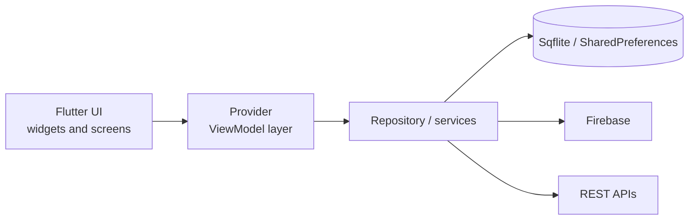

<!--
  SETUP
  1. Create a PUBLIC repo named exactly like your GitHub username: zain9241
  2. Add this file as README.md
  3. Add snake.yml as .github/workflows/snake.yml, then run it once from the Actions tab
  4. Project links below assume repo names like time-tracker-app. Change them to your real repo names.
-->

<div align="center">


<br />

[](https://www.linkedin.com/in/zain-ul-abideen-1a7a23341)
[](mailto:zainsaqib770@gmail.com)

</div>

<br />

Software Engineering student at the **University of Sargodha** (class of 2027). I build cross-platform **Flutter** apps with clean architecture, Provider state management, Firebase and REST APIs, and I have hands-on experience with native Android in Kotlin.

> [!NOTE]
> **Open to Flutter / mobile developer internships.** Email or LinkedIn is the fastest way to reach me.

```text
$ whoami
> Zain Ul Abideen :: Flutter developer :: SE student, University of Sargodha

$ ls ./projects
> time-tracker/     # projects, tasks and time entries, one Provider each
> habit-tracker/    # swipe gestures, weekly reports, local notifications
> notes-app/        # create, edit and organise notes on SQLite
> meme-app/         # memes fetched from a REST API
> fyp-app/          # private final-year project (5 screens built by me)

$ cat stack.txt
> Flutter · Dart · Kotlin · Firebase · Provider · Sqflite

$ status
> [██████████] open to Flutter / mobile internships
```

## ⚡ Tech stack


| Area | What I use |
| --- | --- |
| **Mobile** | Flutter, Dart, cross-platform development, native Android (Kotlin) |
| **Architecture** | MVVM, MVP, Clean Architecture |
| **State management** | Provider |
| **Data & storage** | Sqflite (SQLite), SharedPreferences, Firebase (Auth, Firestore), RESTful APIs |
| **Tools** | Git, GitHub, Android Studio |

## 🚀 Projects

| Project | What it does | Stack | Status |
| --- | --- | --- | --- |
| **[Time Tracker](https://github.com/zain9241/time-tracker-app)** | Log time against projects and tasks. Each entity (Projects, Tasks, Time Entries) has its own model and Provider, with an indigo/violet theme and full dark mode. | `Flutter` `Provider` `shared_preferences` | 🟢 Complete |
| **[Habit Tracker](https://github.com/zain9241/habit-tracker-app)** | Six-screen habit app with swipe-to-complete/undo, a weekly reports table and local notifications. | `Flutter` `SharedPreferences` `flutter_local_notifications` | 🟢 Complete |
| **[Notes App](https://github.com/zain9241/notes-app)** | Create, edit and organise notes with persistent local storage. | `Flutter` `Sqflite` | 🟢 Complete |
| **[Meme App](https://github.com/zain9241/meme-app)** | Fetches memes from a REST API and displays them. | `Flutter` `REST API` | 🟢 Complete |
| **FYP App** | Private final-year project. I designed and built 5 of the front-end screens. | `Flutter` | 🔒 Private |

## 🧱 How I structure Flutter apps



## 💼 Experience

**Android Developer (Kotlin), HiSkyTech** · Sargodha · 3 months

- Built and maintained native Android features with Kotlin and MVVM.
- Integrated Firebase Authentication and Firestore, and built RecyclerView-based UI components.

## 🎓 Education

**BSc Software Engineering**, University of Sargodha · expected 2027

<details>
<summary><b>Certifications (Coursera)</b></summary>

<br />

- Developing Mobile Apps with Flutter (Specialization)
- Mobile App Notifications, Databases, & Publishing
- Flutter and Dart: Developing iOS, Android, and Mobile Apps
- Mobile App Development Capstone Project
- Getting Started with Flutter & Dart

</details>

## 🐍 Contribution snake

<picture>
  <source media="(prefers-color-scheme: dark)" srcset="https://raw.githubusercontent.com/zain9241/zain9241/output/github-snake-dark.svg" />
  <source media="(prefers-color-scheme: light)" srcset="https://raw.githubusercontent.com/zain9241/zain9241/output/github-snake.svg" />
  
</picture>

<!--
## 📊 Stats

Uncomment this block once your contribution graph has some activity.
On a new profile these widgets show zeros and a flat line.


-->

<div align="center">

[](https://www.linkedin.com/in/zain-ul-abideen-1a7a23341)


</div>
